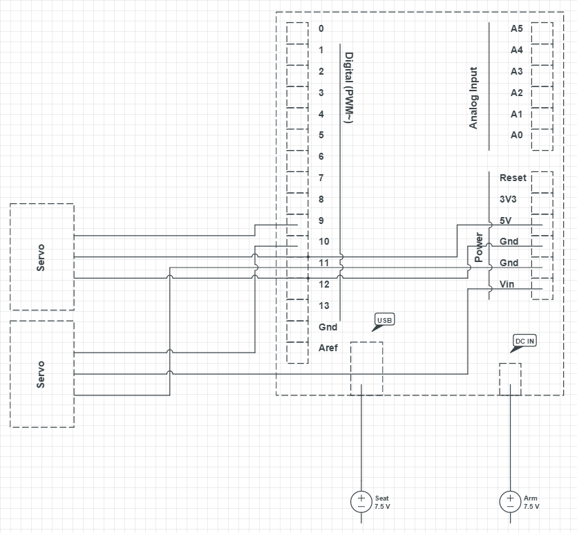

# rubibot
**RubiBot** is a Rubik's cube solving robot built with Arduino, some servos, popsicle sticks, and a lot of glue. The android client is a react-native application used for scanning the faces of the cube.

## Video Demo
<p align="center">
  <a href="https://youtu.be/0IE1nfNaYXA">
  
  </a>
</p>

## Installation

```bash
$ git clone https://github.com/changangela/rubibot
$ cd rubibot
```
### Hardware
Use ```rubibot-arduino``` as sketchbook and run inside Arduino IDE. Both power supply and computer must be plugged in for full power using current configurations, otherwise adjust the servo configuration values.
<p align="center">
  
</p>

### React-native Server
```bash
$ cd react-client
$ npm install
$ react-native start
```

### React-native Client
```bash
# Ensure device is connected and authorized
$ adb reverse tcp:8081 tcp:8081 # if Android 5.0 (Lollipop)
$ react-native start
```

### Server
```bash
$ cd server
$ node tcp-server
$ python start-server.py # whichever one works
```

## Design
<p align="center">
  
</p>
